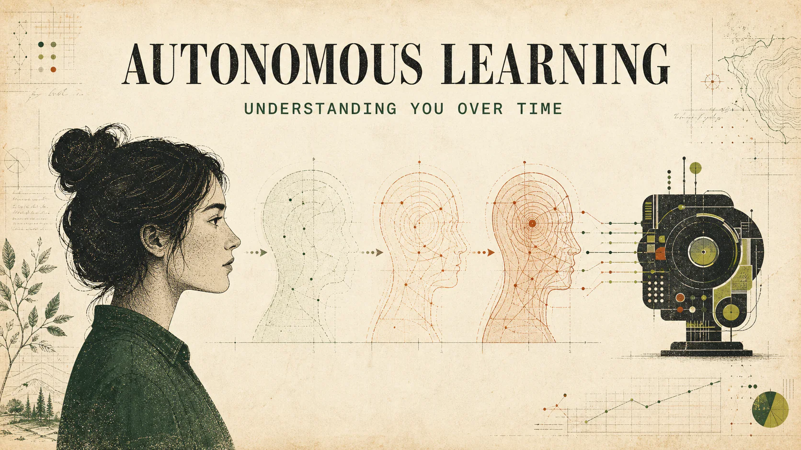
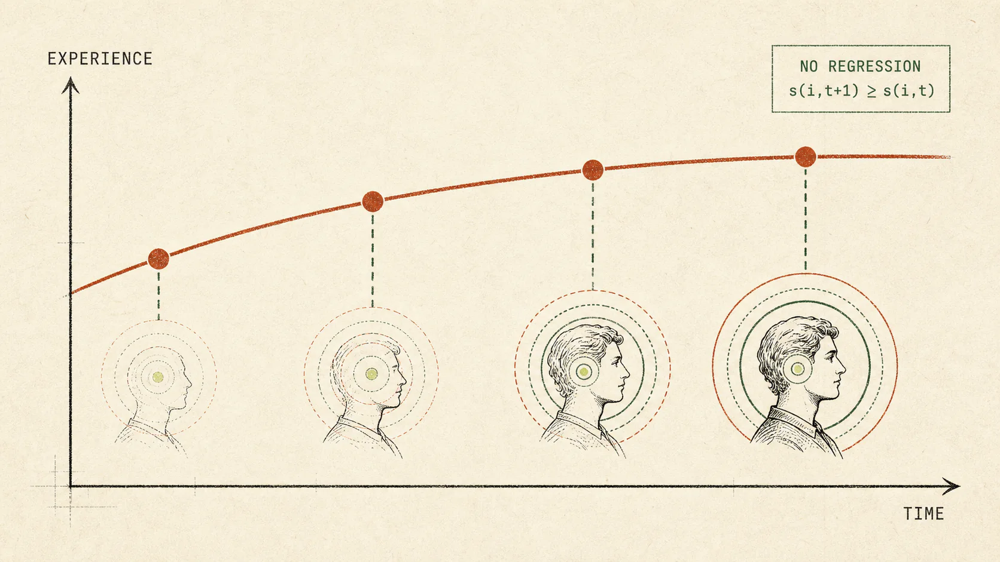
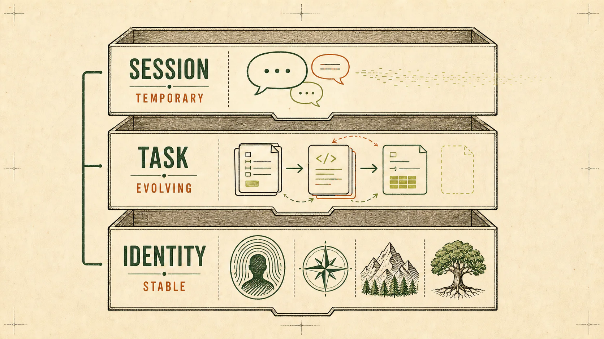

## Introduction



In 2025, “autonomous learning” became one of the hottest topics in Silicon Valley’s AI community. In cafés, technical forums, and research labs, the same question kept appearing on whiteboards: pretraining has already delivered 70 to 80 percent of its potential gains, and reinforcement learning is entering harder territory—so what comes next? Many have turned to autonomous learning.

Yet ask what autonomous learning actually means, and the answers vary. Some say it means models that can improve their own code. Others point to AI scientists capable of conducting research independently, or to systems that continually evolve through user feedback. All of these answers are valid, but none is complete.

This essay approaches autonomous learning from a more fundamental perspective: it is not only about continually improving model capabilities, but also about continually improving each individual’s experience.

## 1. The Essence of Autonomous Learning

Let us begin with a more precise definition: for every individual $i$, their experience $s(i,t)$ improves monotonically over time $t$.



This definition has three essential elements.

First, **every individual**. The goal is not merely to improve the average experience across a population, but to improve the experience of each specific user. This is the fundamental difference between population-level and individual-level learning.

Second, **time**. Autonomous learning must have a temporal dimension. Today’s AI should understand you better than yesterday’s did, and tomorrow’s should understand you better than today’s does. This is not a one-off training run, but an ongoing process of evolution.

Third, **monotonic improvement**. The experience must not regress. Learning something new should not mean forgetting what came before; adapting to a new setting should not erase the system’s understanding of an old one. This differs fundamentally from the current model-training paradigm.

The current pattern is: collect data → train a model → deploy it → collect new data → retrain. It is discrete, batched, and population-level. Autonomous learning, by contrast, should be continuous, real-time, and individual.

## 2. Who Is “You”? Scenarios and Environments

When we say that AI should understand “you” better over time, who exactly is this “you”?

On the surface, “you” is a person—a specific user. More precisely, however, “you” represents that person’s contexts and environments.

One person’s work environment may revolve around the Microsoft Office suite. They need AI to work with documents, create presentations, and analyze spreadsheets. Their job comes with rules they must follow, along with formats and styles they prefer.

Another person may be a software engineer with their own coding habits, a preferred technology stack, and team coding conventions. They want AI to remember these details instead of making them explain everything from scratch each time.

The harder problem is that a person’s contexts and environments change. Someone may focus on machine learning one year and move to reinforcement learning the next. If those memories are encoded in the model’s parameters, the model may conclude that the person is interested in both fields, even though they have moved on from machine learning.

That leads to a central question: when the environment changes, what should memory retain, and what should it let go?

## 3. Memory Is Inherently Lossy—and That Is Acceptable

Several engineering approaches already address this problem. Memory projects such as mem0 store user preferences in a vector database and add them to the context when appropriate.

This approach has an obvious limitation: a model’s context window is finite. As interactions accumulate, so does the volume of stored memories. Only a subset can be loaded into the context, so some information will inevitably be lost.

Does that mean the current approach is flawed? Not necessarily. We first need to ask a more fundamental question: isn’t human memory lossy too?

Human memory has several familiar characteristics:

- Working memory has limited capacity and can handle only about $7\pm2$ chunks of information at once.
- Episodic memories fade, while semantic memories persist. You may forget what you ate for lunch last Tuesday, yet remember that you dislike cilantro.
- Most specific information is lost quickly along the forgetting curve.

Yet humans still function effectively. Why? Because the key is not whether memory is lossy, but how intelligently we choose what to retain.

One possible direction is to treat memory not merely as a store of events, but as a system for distilling rules.

```text
Specific event: The user previously asked for a concise answer
    ↓ Abstract
General rule: The user prefers concise responses
    ↓ Compress
User trait: [Preference for concision: high]
```

This is one of the core ideas behind advanced coding agents such as Claude Code: rules and conventions drive their behavior. Files such as `CLAUDE.md` and `AGENTS.md` preserve a user’s rules explicitly. Rather than recording specific events, they capture the conventions and preferences abstracted from those events.

## 4. Memory Consolidation: Sleep for AI

In one discussion, Professor Qiang Yang offered an interesting analogy: people sleep every night to clear away noise, allowing accuracy to keep improving the next day rather than letting errors accumulate.

AI may need a similar consolidation mechanism:

- **Merge similar memories periodically.** Combine repeated interactions into a single rule.
- **Detect and resolve conflicting memories.** When two memories disagree, use recency and frequency to judge which is more reliable.
- **Remove long-inactive memories.** Let information decay when it has not been activated for a long time.

A simple expression captures the idea:

> Memory strength = initial strength × time-decay factor × recent activation count

A long-inactive memory about “machine learning” would gradually weaken. If the user suddenly returns to the subject, it could be reactivated. Memories marked as core preferences would decay more slowly.

This mechanism allows the memory system to adapt as the environment changes: old, irrelevant information fades naturally, while core, stable preferences remain.

## 5. A User Manual: Making You Easy to Understand

If training a dedicated model for every person remains impractical for the foreseeable future, we can approach the problem differently. Rather than asking a doctor to remember every patient, give each patient a medical record that the doctor can review to understand them quickly.

For AI, that would mean:

- Each user has a highly compressed user profile or “user manual.”
- The manual is structured and machine-readable.
- A model can load the user’s essential traits in a few hundred tokens.

This user manual could be:

- **Explicit:** preferences written directly by the user.
- **Implicit:** patterns extracted automatically from prior interactions.
- **Dynamic:** updated continuously through new interactions.

In essence, the system maintains a memory database for each user. That database is the user’s manual: it is periodically updated, consolidated, checked for conflicts, and cleared of long-inactive memories.

The model itself does not need to “remember” you. It only needs to understand your manual. This reframes the problem from “How can the model keep learning?” to “How can we maintain a high-quality user profile?”

## 6. A Hierarchy of Memory

Not all memories are equal. A more useful design would organize them into distinct layers:



| Layer | Contents | Update frequency | Decay rate |
| --- | --- | --- | --- |
| Identity | Basic attributes, core preferences, long-term habits | Low | Slow |
| Task | Active projects and areas of recent interest | Medium | Moderate |
| Session | Current conversational context and temporary needs | High | Fast; cleared when the session ends |

For example:

- **Identity:** “The user is a backend engineer who prefers concise code and uses Python.”
- **Task:** “The user is currently working on a reinforcement-learning project in PyTorch.”
- **Session:** “In this conversation, the user wants to discuss how to implement PPO.”

Each layer needs a different update policy and decay rate. Identity information should remain highly stable unless there is a clear signal that the person’s basic attributes have changed. Task information evolves as a project progresses. Session information is temporary and local.

This hierarchy allows the system to balance stability and flexibility: core identity remains stable, tasks evolve over time, and sessions remain flexible.

## 7. Two Levels of Continual Learning

Any discussion of autonomous learning needs to distinguish between two different levels.

**Population-level continual learning:** the model learns from data across all users and becomes more capable overall. This is already happening—each generation of models is stronger than the last, partly because it uses more user interaction data.

**Individual-level continual learning:** the model improves for each user individually and comes to understand that particular person better over time. This is the real challenge.

Population-level learning is relatively straightforward: data is abundant, standard training pipelines can be used, and the model’s parameters are updated uniformly. Individual-level learning faces more fundamental constraints:

- Training a separate model for every user would be prohibitively expensive.
- Encoding every user’s preferences in one model would cause them to interfere with one another.
- Relying entirely on context is constrained by finite windows and lossy retrieval.

A pragmatic alternative is to treat individual-level “continual learning” not as individual parameterization, but as the optimization of individual experience.

Better memory management, smarter context selection, and more precise user representations could make a model feel as though it understands each person better over time—even if its parameters never change specifically for them.

This is an engineering problem rather than a training problem, but the result may be good enough.

## 8. B2B and Consumer AI: Two Different Battlegrounds

Autonomous learning faces entirely different challenges in B2B (ToB) and consumer (ToC) settings.

| Dimension | Consumer (ToC) | B2B (ToB) |
| --- | --- | --- |
| Environment | Fluid, ambiguous, personal | Relatively stable and definable |
| Feedback signal | Hard to quantify—satisfaction, happiness? | Explicit—revenue, efficiency, accuracy |
| Number of users | Vast numbers of individuals, each different | A limited set of scenarios that can be optimized one by one |
| Objective function | Unclear; “good” is difficult to define | Definable and measurable |

As Junyang Lin observed in one discussion, personalization in the era of recommendation systems had clear metrics: click-through rates and purchase rates. But in the AI era, when technology reaches into every aspect of human life, what is the right measure of true personalization? We do not yet know.

That may mean the next breakthroughs in autonomous learning are more likely to happen in B2B settings:

- **Trading agents:** learn from mistakes, retain the patterns of a particular market, and avoid making the same mistakes again.
- **Coding agents:** become familiar with a particular codebase, remember the team’s coding conventions, and become easier to work with over time.
- **Customer-service agents:** learn a particular company’s product knowledge and remember how to handle common questions.

These settings offer explicit reward signals, relatively stable environments, and measurable indicators of improvement. That makes continuous iteration possible.

Consumer autonomous learning may have to wait for more fundamental advances, whether in evaluation methods or personalization technology.

## 9. The Future Is Already Happening

Autonomous learning is not a distant vision of the future. In some form, it is already happening.

Shunyu Yao raised the following questions in a discussion:

> ChatGPT uses user data to adapt its conversational style, making the experience feel better over time. Is that a form of self-learning? Claude Code has written 95% of the code in the Claude Code project, helping itself improve. Is that a form of self-learning?

The answer is yes. These are early forms of autonomous learning. They remain confined to particular settings and have not yet reached the general, individualized, and continuous state we expect.

Perhaps autonomous learning will not arrive through a sudden paradigm shift, but through a gradual process:

- From population-level learning to individual learning.
- From discrete updates to continuous evolution.
- From passive responses to proactive understanding.

That process has already begun.

We are standing at an interesting point in time: early enough to help shape its direction, but late enough to see its outline.
