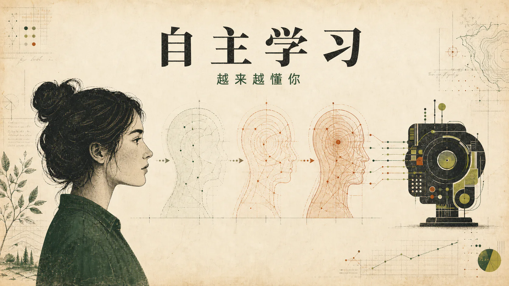
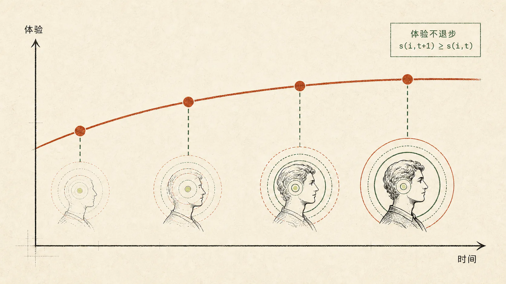
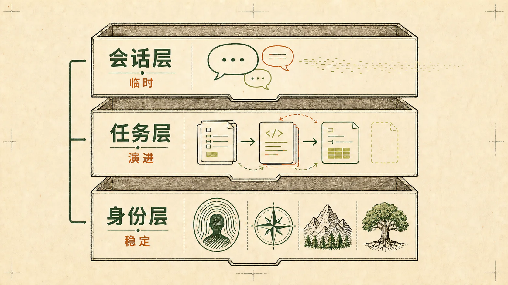

## 引言



2025 年，「自主学习」成为硅谷 AI 圈最热门的话题之一。在咖啡馆、技术论坛和各大实验室的白板上，人们都在讨论：预训练已经走完了七八成的收益，强化学习也开始进入深水区，下一个范式是什么？很多人把目光投向了自主学习。

但当你追问「什么是自主学习」时，每个人的答案却不尽相同。有人说是模型能自己改进自己的代码，有人说是 AI 科学家能独立做研究，也有人说是系统能从用户反馈中持续进化。这些答案都对，但都不够完整。

本文试图从一个更本质的角度理解自主学习：它不仅是模型能力的持续提升，更是对每一个个体体验的持续改善。

## 一、自主学习的本质定义

让我们先给出一个更精确的描述：对每一个个体 $i$，体验 $s(i,t)$ 随时间 $t$ 单调改善。



这个定义有三个关键要素。

第一，**每一个个体**。不是整体平均水平的提升，而是每一个具体用户的体验都在变好。这是群体层面学习和个体层面学习的根本区别。

第二，**时间维度**。自主学习必须包含时间的概念。今天的 AI 比昨天更懂你，明天比今天更懂你。这不是一次性的训练，而是持续的进化。

第三，**单调改善**。体验不能倒退。学了新东西不能忘记旧的，适应了新场景不能丢失对旧场景的理解。这与当前的模型训练范式有本质不同。

当前的范式是：收集数据 → 训练模型 → 部署上线 → 收集新数据 → 重新训练。它是离散的、批量的、群体层面的；自主学习则应该是连续的、实时的、个体层面的。

## 二、「你」是谁：场景与环境的概念

当我们说「让 AI 越来越懂你」时，这个「你」究竟指什么？

表面上看，「你」是一个人——用户张三、用户李四。但更准确地说，「你」代表的是人背后的场景和环境。

一个人的工作环境可能是 Office 三件套，他需要 AI 帮他处理文档、制作 PPT、分析表格。他有一套工作中不得不遵守的规范，也有自己习惯的格式和风格。

另一个人是代码工程师，他有自己的编码习惯、偏好的技术栈和团队的代码规范。他希望 AI 能记住这些，而不是每次都从头解释。

更复杂的是，人的场景和环境会发生变化。一个人可能一年前专注于机器学习，一年后已经转向强化学习。如果 AI 的记忆被参数化到模型内部，模型可能会认为这个用户「同时关注机器学习和强化学习」，但实际上，用户已经不再关注机器学习了。

这就引出了一个核心问题：当环境变化时，记忆如何取舍？

## 三、记忆的本质：有损是可以接受的

当前工程上已经有一些解决思路，比如 mem0 等记忆项目通过向量数据库存储用户偏好，并在合适的时候将其加入上下文。

但这种方案有一个明显的问题：模型的上下文窗口有限。随着交互次数越来越多，记忆数据也会越来越大。我们只能将部分信息加入上下文，这意味着必然会有信息损失。

这是否意味着当前方案存在缺陷？不一定。我们需要追问一个更根本的问题：人类的记忆难道不是有损的吗？

人类的记忆系统有几个特点：

- 工作记忆容量有限，大约只能同时处理 $7\pm2$ 个信息块。
- 情景记忆会遗忘，但语义记忆会保留。你可能忘了上周二中午吃了什么，但记得自己不喜欢香菜。
- 大部分具体信息会沿着遗忘曲线在短时间内丢失。

但人类依然能够高效地运作。为什么？因为问题的关键不是「有损」，而是「如何智能地选择保留什么」。

一个可能的方向是：记忆不应该只是「存储事件」，而应该「提炼规则」。

```text
具体事件：用户上次让我用简洁风格回答
    ↓ 抽象
抽象规则：用户偏好简洁
    ↓ 压缩
用户特征：[简洁度偏好：高]
```

这正是当前一些先进的 Coding Agent（如 Claude Code）的核心思想之一：由规则和规范驱动。通过 `CLAUDE.md`、`AGENTS.md` 等文件，用户的规则被显式保存下来。这些文件记录的不是具体事件，而是从事件中抽象出的规范和偏好。

## 四、记忆的整理机制：AI 的「睡眠」

杨强教授在一次讨论中提到了一个有趣的类比：人类每天晚上睡觉，其实是在清理噪音，使第二天的准确率能够持续提升，而不是让错误不断累积。

AI 可能也需要类似的「整理」机制：

- **定期合并相似记忆**：将多次相似的交互合并为一条规则。
- **检测并解决冲突记忆**：发现矛盾信息时，根据时间和频率判断哪个更可信。
- **删除长期未激活的记忆**：长期不被提及的信息逐渐衰减。

这可以用一个简单的公式描述：

> 记忆强度 = 初始强度 × 时间衰减因子 × 近期激活次数

长期不被提及的「机器学习」记忆会逐渐衰减，但如果用户突然再次提到，它可以被「激活」恢复。某些被标记为「核心偏好」的记忆衰减得更慢。

这种机制使记忆系统能够自适应地处理环境变化：旧的、不再相关的信息自然淡出，核心而稳定的偏好得以保留。

## 五、用户说明书：让你「可被快速理解」

如果「为每个人训练一个专属模型」在可预见的未来都不可行，那我们可以换一个思路：不是让医生记住每个病人，而是让病人拥有一份病历，医生每次查看病历就能快速理解他。

这意味着：

- 用户拥有一个高度压缩的「用户协议」或「用户说明书」。
- 这份说明书是结构化的、可被机器解析的。
- 模型能够在几百 token 内「加载」用户的核心特征。

这份「用户说明书」可以是：

- **显式的**：用户自己撰写的偏好设定。
- **隐式的**：从历史交互中自动提炼。
- **动态的**：随着交互不断更新。

本质上，这是在维护一个用户的记忆数据库。这个数据库就是用户的「说明书」，它会定期更新、合并、检测冲突，并删除长期未激活的记忆。

模型本身不需要「记住」你，它只需要能够「理解」你的说明书。这把问题从「如何让模型持续学习」转化为「如何维护一个高质量的用户画像」。

## 六、记忆的层级结构

并非所有记忆都是平等的。一个更合理的设计是将记忆分为不同层级：



| 层级 | 内容 | 更新频率 | 衰减速度 |
| --- | --- | --- | --- |
| 身份层 | 用户的基本属性、核心偏好、长期习惯 | 低频 | 慢 |
| 任务层 | 当前正在进行的项目、近期关注的领域 | 中频 | 中等 |
| 会话层 | 本次对话的上下文、临时需求 | 高频 | 快（会话结束即清除） |

举个例子：

- **身份层**：「用户是后端工程师，偏好简洁的代码风格，使用 Python。」
- **任务层**：「用户最近在做一个强化学习项目，使用 PyTorch。」
- **会话层**：「用户这次想讨论 PPO 算法的实现细节。」

不同层级有不同的更新策略和衰减速度。身份层的信息应该非常稳定，除非有明确信号表明用户的基本属性发生了变化。任务层的信息会随着项目推进而演变。会话层的信息则是临时而局部的。

这种分层结构使系统能够同时处理稳定性和灵活性：核心身份保持稳定，任务随时间演进，会话保持灵活。

## 七、两个层面的持续学习

讨论自主学习时，我们需要区分两个不同的层面。

**群体层面的持续学习**：模型从所有用户的数据中学习，整体能力变强。这已经在发生——每一代模型都比上一代更强，部分原因就是利用了更多用户交互数据。

**个体层面的持续学习**：模型对每个用户单独变好，越来越懂「你」这个特定的人。这是真正的难点。

群体层面的学习相对容易：数据量大，可以使用标准训练流程，模型参数统一更新。个体层面的学习则面临根本性的挑战：

- 无法为每个用户训练一个模型，成本不可接受。
- 将所有用户的偏好塞进同一个模型会相互干扰。
- 纯粹依赖上下文会受到窗口有限和检索有损的限制。

也许一个务实的思路是：个体层面的「持续学习」不需要做到「个体参数化」，而是做到「个体体验优化」。

通过更好的记忆管理、更智能的上下文选择和更精准的用户表征，让每个人感觉模型越来越懂自己——即使模型的参数并没有为他专门改变。

这是工程问题，不是训练问题，但效果可能已经足够好。

## 八、ToB 与 ToC：两种不同的战场

自主学习在 ToB 和 ToC 场景下面临完全不同的挑战。

| 维度 | ToC | ToB |
| --- | --- | --- |
| 环境 | 多变、模糊、个人化 | 相对固定、可定义 |
| 反馈信号 | 难以量化（满意度？开心？） | 明确（收益、效率、准确率） |
| 用户数量 | 海量个体，每个人都不同 | 有限场景，可以逐个优化 |
| 目标函数 | 不清晰，难以定义什么是「好」 | 可定义、可测量 |

正如林俊旸在讨论中提到的：在推荐系统时代，个性化的指标是点击率、购买率，非常明确。但在 AI 时代，当技术覆盖到人类生活的方方面面时，真正的个性化衡量指标是什么？我们其实并不清楚。

这可能意味着，近期自主学习的突破更可能发生在 ToB 场景：

- **交易 Agent**：在交易中犯错，总结经验，记住特定市场的规律，下次避免同样的错误。
- **编码 Agent**：熟悉特定代码库的结构，记住团队的编码规范，越用越顺手。
- **客服 Agent**：学习特定公司的产品知识，记住常见问题的处理方式。

这些场景有明确的 reward 信号、相对固定的环境和可量化的改进指标。这让「持续迭代」成为可能。

而 ToC 场景的自主学习，可能需要等待更根本的突破——无论是在评估方法上，还是在个性化技术上。

## 九、已经在发生的未来

最后，值得指出的是：自主学习并不是一个遥远的未来愿景，它已经在以某种形式发生。

姚顺雨在讨论中提到：

> ChatGPT 利用用户数据拟合聊天风格，使它的感觉越来越好，这是不是一种自我学习？Claude Code 已经写了 Claude Code 这个项目 95% 的代码，在帮它自己变得更好，这是不是一种自我学习？

答案是：是的，这些都是自主学习的早期形态。只是它们还局限在特定场景下，还没有达到我们期待的那种「通用的、个体化的、持续的」状态。

也许自主学习不会是一次突然的范式转换，而是一个渐进的过程：

- 从群体学习到个体学习。
- 从离散更新到持续进化。
- 从被动响应到主动理解。

这个过程已经开始了。

我们正站在一个有趣的时间点上：足够早，可以参与塑造它的方向；又足够晚，可以看到它的雏形。
